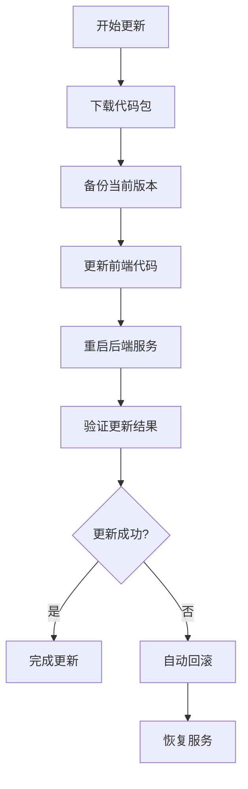

# 🔥 DockPilot 热更新功能

这是DockPilot的热更新版本，支持在容器内进行代码热更新，无需重启容器或重新构建镜像。

## ✨ 特性

- 🔄 **容器内热更新**: 无需重启容器，在线更新前后端代码
- 🎯 **用户友好**: 右上角更新提示，一键检查和执行更新
- 🛡️ **安全可靠**: 自动备份，失败自动回滚
- 📊 **实时反馈**: 更新进度实时显示，日志详细记录
- 🚀 **快速部署**: 从GitHub Releases自动下载最新代码

## 🏗️ 架构原理

```
基础镜像 (Alpine + JRE + Caddy) ─┐
                                  ├─► 容器启动
启动脚本 ─────────────────────────┘
    │
    ├─► 检查版本
    │
    ├─► 下载代码 (GitHub Releases)
    │   ├─► frontend.tar.gz
    │   └─► backend.jar
    │
    ├─► 启动服务
    │   ├─► Caddy (前端服务)
    │   └─► Java (后端服务)
    │
    └─► 运行时热更新
        ├─► 前端: 替换文件 (Caddy自动加载)
        └─► 后端: 重启Java进程
```

## 🚀 快速开始

### 方法一：使用热更新镜像

```bash
# 拉取热更新镜像
docker pull kidself/dockpilot-hot:latest

# 启动容器
docker run -d --privileged \
  --name dockpilot-hot \
  -p 8888:8888 \
  -v /var/run/docker.sock:/var/run/docker.sock \
  -v /:/mnt/host \
  -v /home/dockpilot:/dockpilot \
  --restart unless-stopped \
  kidself/dockpilot-hot:latest
```

### 方法二：从现有容器升级

1. 停止现有容器
2. 备份数据目录
3. 启动热更新版本容器
4. 数据会自动迁移

## 🔧 环境变量

| 变量名 | 默认值 | 说明 |
|--------|--------|------|
| `DOCKPILOT_VERSION` | `latest` | 指定要下载的版本 |
| `DOWNLOAD_URL_BASE` | `https://github.com/kidoneself/DockPilot/releases/download` | 下载基础URL |

## 📋 使用方法

### 1. 检查更新

- 访问 `http://localhost:8888`
- 点击右上角的更新按钮 (🔄 图标)
- 系统会自动检查GitHub是否有新版本

### 2. 执行热更新

- 如果发现新版本，会显示更新对话框
- 查看更新内容和版本信息
- 点击"开始更新"
- 实时查看更新进度

### 3. 更新流程



## 🛠️ 开发者指南

### 后端开发

1. **添加UpdateController和UpdateService**
   ```bash
   # 复制文件到对应目录
   cp hot-update/UpdateController.java docker-manager-back/src/main/java/com/dsm/controller/
   cp hot-update/UpdateService.java docker-manager-back/src/main/java/com/dsm/service/http/
   cp hot-update/UpdateInfoDTO.java docker-manager-back/src/main/java/com/dsm/model/dto/
   ```

2. **修改API导出**
   ```typescript
   // 在 dockpilotfront/src/api/http/index.ts 中添加
   export * from './update'
   ```

### 前端开发

1. **添加更新API**
   ```bash
   cp hot-update/update.ts dockpilotfront/src/api/http/
   ```

2. **添加更新组件**
   ```bash
   cp hot-update/UpdateNotification.vue dockpilotfront/src/components/
   ```

3. **在布局中引入组件**
   ```vue
   <template>
     <div class="layout-header">
       <!-- 其他组件 -->
       <UpdateNotification />
     </div>
   </template>
   
   <script setup>
   import UpdateNotification from '@/components/UpdateNotification.vue'
   </script>
   ```

### CI/CD配置

1. **添加GitHub Actions**
   ```bash
   cp hot-update/build-and-release.yml .github/workflows/
   ```

2. **配置Secrets**
   - `DOCKER_USERNAME`: DockerHub用户名
   - `DOCKER_PASSWORD`: DockerHub密码

3. **发布版本**
   ```bash
   # 创建标签并推送
   git tag v1.0.0
   git push origin v1.0.0
   
   # 或手动触发
   # 在GitHub Actions页面手动运行工作流
   ```

## 📁 文件结构

```
hot-update/
├── Dockerfile              # 热更新镜像构建文件
├── start-hot-update.sh     # 支持热更新的启动脚本
├── download-app.sh         # 应用代码下载脚本
├── Caddyfile              # Caddy配置文件
├── UpdateController.java   # 后端更新控制器
├── UpdateService.java      # 后端更新服务
├── UpdateInfoDTO.java     # 更新信息DTO
├── update.ts              # 前端更新API
├── UpdateNotification.vue # 前端更新组件
├── build-and-release.yml  # GitHub Actions配置
└── README.md              # 使用说明
```

## 🔍 故障排除

### 常见问题

1. **更新下载失败**
   - 检查网络连接
   - 确认GitHub Releases中存在对应版本
   - 查看容器日志: `docker logs dockpilot-hot`

2. **Java应用启动失败**
   - 检查jar文件是否完整
   - 查看启动日志: `/dockpilot/logs/application-restart.log`
   - 确认JVM内存是否足够

3. **前端文件无法访问**
   - 检查文件权限: `ls -la /usr/share/html/`
   - 重启Caddy服务
   - 查看Caddy日志: `/dockpilot/logs/caddy-error.log`

### 日志位置

- **容器启动日志**: `docker logs dockpilot-hot`
- **应用日志**: `/dockpilot/logs/application.log`
- **更新日志**: `/dockpilot/logs/application-restart.log`
- **Caddy日志**: `/dockpilot/logs/caddy-access.log`

### 手动回滚

如果自动回滚失败，可以手动操作：

```bash
# 进入容器
docker exec -it dockpilot-hot /bin/bash

# 恢复备份（如果存在）
cp /tmp/dockpilot-backup/backend.jar /app/app.jar
cp -r /tmp/dockpilot-backup/frontend/* /usr/share/html/

# 重启Java服务
pkill -f "java.*app.jar"
cd /app && java -jar app.jar &
```

## 📊 性能优化

1. **网络优化**
   - 使用CDN加速GitHub下载
   - 配置HTTP代理

2. **存储优化**
   - 定期清理备份文件
   - 压缩日志文件

3. **内存优化**
   - 调整JVM参数
   - 监控内存使用情况

## 🛡️ 安全建议

1. **网络安全**
   - 使用HTTPS访问
   - 配置防火墙规则
   - 限制管理访问

2. **更新安全**
   - 验证下载文件完整性
   - 在测试环境先验证
   - 定期备份重要数据

3. **权限安全**
   - 使用最小权限原则
   - 定期更新基础镜像
   - 监控异常活动

## 🤝 贡献

欢迎提交Issue和Pull Request来改进热更新功能！

## 📄 许可证

本项目采用 MIT 许可证。 